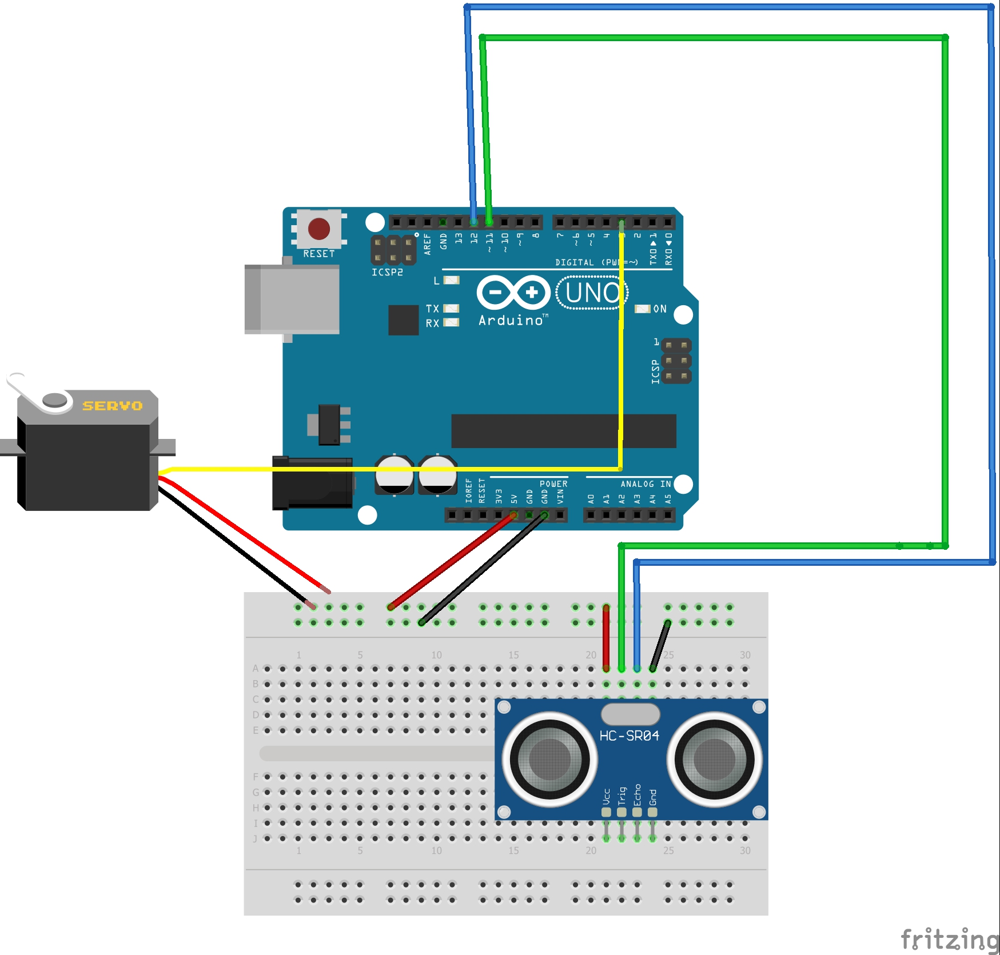

#Arduino

Loren's arduino assignments.

			  			  hello_functions  

I used a function to have the Hc-sro4 measure the distance constantly with a small 
delay and moves the servo based on the distance it finds.

						Learned
* I learned what a fuction is, what is used for, and how to use it.

* I learned how to take the distance and effencietly (with small amount of code) make the servo turn based on it

* I learned how to use the Hc-sr04

							Fritzing

Made by Heming

							NewPing 

When you press the button the Hc-sr04 finds the distance and and lcd diplays it 
utill the button is pressed again and it displays the new distance.

							Learned

* I relearned the lcd wiring and code

* I also relearned the code to have the button be activated once when pressed/held down.

							Fritzing
